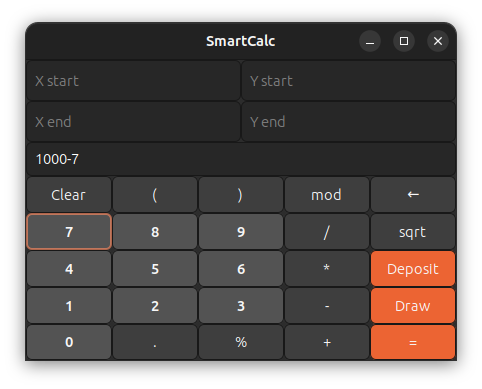
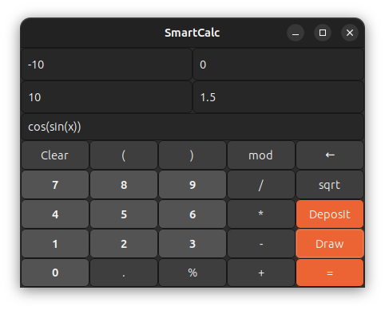
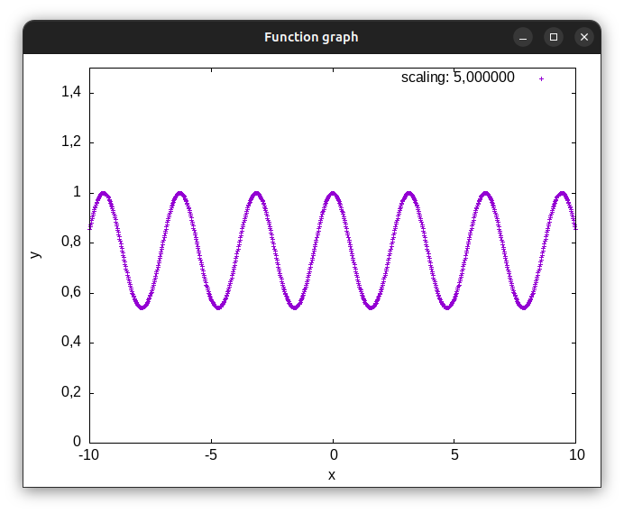

# Calculator

Реализация SmartCalc v1.0.

## Программа калькулятор

В данном проекте реализована расширенная версию обычного калькулятора, который поддерживает вычисление выражений, функций и построение графиков. Интерфейс программы реализован при помощи фреймворка GTK+ (v3.0).

Калькулятор способен работать со следующими операторами и функциями:

- **Арифметические операторы**:

    | Название оператора | Инфиксная нотация   (Классическая) | Префиксная нотация   (Польская нотация) |  Постфиксная нотация   (Обратная польская нотация) |
    | ------ | ------ | ------ | ------ |
    | Скобки | (a + b) | (+ a b) | a b + |
    | Сложение | a + b | + a b | a b + |
    | Вычитание | a - b | - a b | a b - |
    | Умножение | a * b | * a b | a b * |
    | Деление | a / b | / a b | a b \ |
    | Возведение в степень | a ^ b | ^ a b | a b ^ |
    | Остаток от деления | a mod b | mod a b | a b mod |
    | Унарный плюс | +a | +a | a+ |
    | Унарный минус | -a | -a | a- |

- **Функции**:

    | Описание функции | Функция |   
    | ---------------- | ------- |  
    | Вычисляет косинус | cos(x) |   
    | Вычисляет синус | sin(x) |  
    | Вычисляет тангенс | tan(x) |  
    | Вычисляет арккосинус | acos(x) | 
    | Вычисляет арксинус | asin(x) | 
    | Вычисляет арктангенс | atan(x) |
    | Вычисляет квадратный корень | sqrt(x) |
    | Вычисляет натуральный логарифм | ln(x) | 
    | Вычисляет десятичный логарифм | log(x) |

## Интерфейс
- **Вычисление выражения**:

- **Построение граффиков**:
  
  
